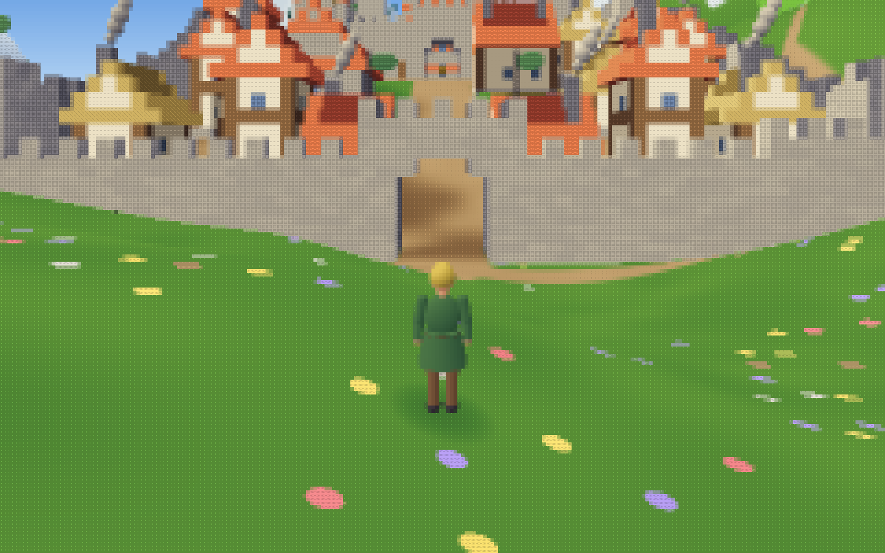
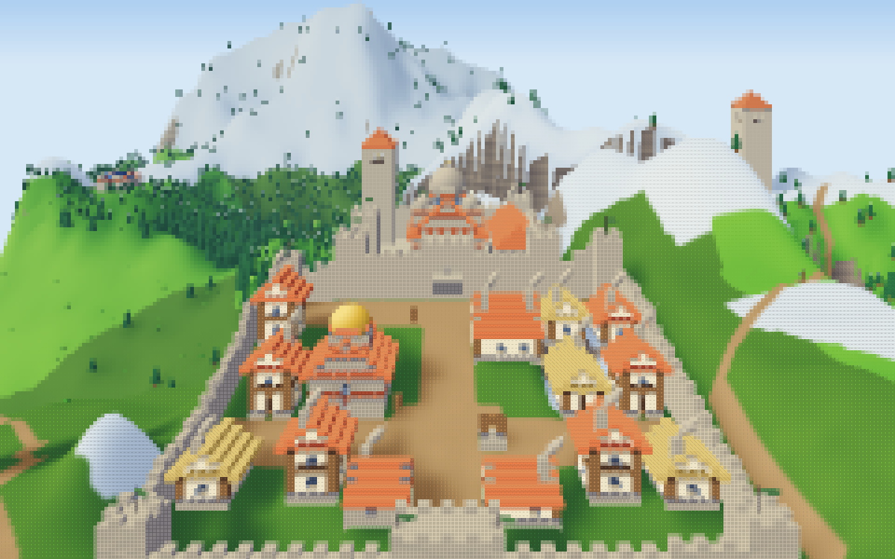
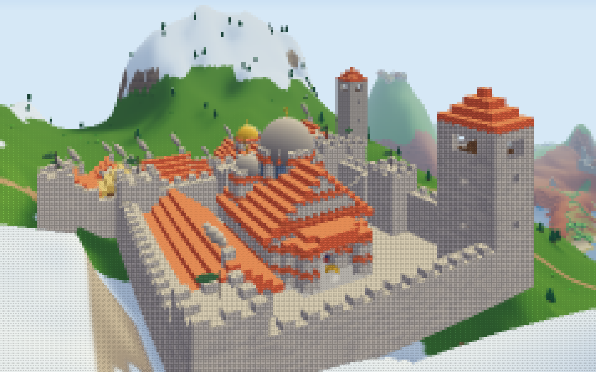
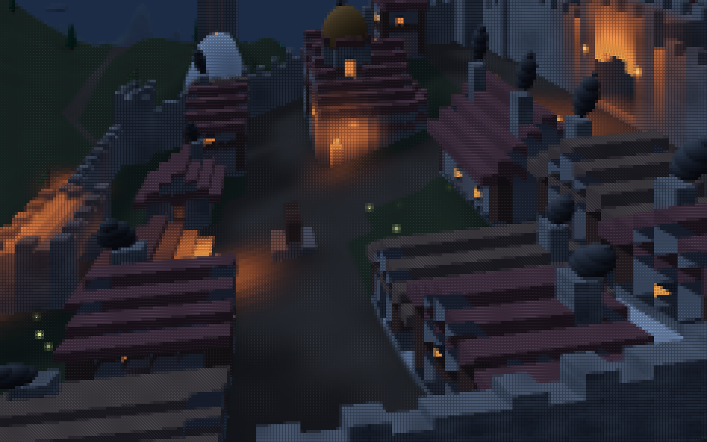
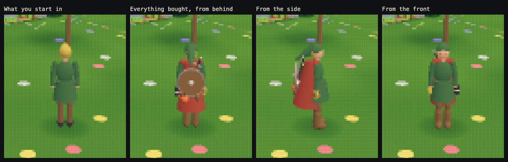

# Land of Ascii

**▶ Play it in your browser: https://oddslice.github.io/land-of-ascii/**

A desktop browser with a keyboard and mouse works best. Click to start, WASD to walk, the mouse to look around, V to switch between your hero and your own eyes. Press R for a whole new world.

An explorer drawn as a mosaic of text characters: a seeded world of terrain, rivers, castles with walled towns at their feet, villages, roads, forests, travelling merchants, torches and campfires, which you can walk, fly and trade in. You walk it as a hero seen from behind, as in Ocarina of Time, or through their eyes, and what you buy from the merchants shows on your hero. Every cell of the screen is one glyph from a hand-built palette; the trees, the merchants and your hero are real 3D solids.

| | |
|---|---|
|  |  |
|  |  |



Land of Ascii started as v2 of [Text Voxel](https://github.com/OddSlice/text-voxel): phase 1 rebuilt the renderer and took over v1's simulation (fixes are listed in `tools/lib/v2-fixes.mjs`). Phase 2 gave it a world of its own, phase 3 your hero in a bigger world, and phase 4 a world that makes sense (castles round Orthodox churches, spread over the land, each with a walled town): see the docs below. It is one self-contained `index.html`: no build, no dependencies, so you can also just open the file. v1 stays live for comparison: https://oddslice.github.io/text-voxel/.

## Controls

As v1: click to capture the mouse (Esc releases it; where pointer lock is refused, drag to look). The mouse turns you; with your hero in view, up and down raise and lower the camera.

| Key | Action |
|---|---|
| W A S D | walk (or fly) |
| Space / Shift | jump / sprint (walking) · up / down (flying) |
| F | walk / fly |
| E | talk to the merchant named in the prompt (what you buy shows on your hero) |
| R | new random seed |
| T | clock ×10 |
| − / + | cell size: 5×10, 6×12, 7×14, 8×16 px |
| [ / ] | view distance |
| L | look: painted (default) or mosaic |
| V | your hero (default) or your own eyes |
| H | hide or show the keys (the legend, bottom left) |

In the address: `?seed=42` for a given world, `?look=mosaic`, and `?weather=rain`, `snow`, `fog`, `aurora` or `clear` to pin the weather. Otherwise each day brings its own weather.

## Docs

- **[docs/phase2-world.md](docs/phase2-world.md)**: the phase 2 brief (in progress). Varied land, villages and towns, people and animals, and the tests that change with the world.
- **[docs/phase2.md](docs/phase2.md)**: phase 2 as it is built. Step 1: eight regions, terrain shaped per region, new ground materials, rock strata ([pictures](shots/phase2/sheet-regions.png)). Then the painted look, shadows and water mirrors ([mosaic and painted side by side](shots/phase2/sheet-looks-1.png)). Step 2, the land: plants for every region, bridges, and weather with fireflies and auroras at night ([regions](shots/phase2/step2/sheet-regions.png), [bridges](shots/phase2/step2/sheet-bridges.png), [weather](shots/phase2/step2/sheet-weather.png)).
- **[docs/phase4.md](docs/phase4.md)**: phase 4, a world that makes sense (in progress). Step 1: castles built round an Orthodox church (iconostasis, frescoes, candles, domes), with a keep and its bell, a great hall, and village chapels as small churches ([castles](shots/phase4/step1/sheet-castles.png), [inside](shots/phase4/step1/sheet-castle-inside.png), [the chapel](shots/phase4/step1/sheet-chapel.png)). Step 2: a castle to each part of the land, each facing a walled town at its foot, with watchtowers on the passes and ruins in the wild ([towns](shots/phase4/step2/sheet-towns.png), [inside a town](shots/phase4/step2/sheet-in-town.png), [towers and ruins](shots/phase4/step2/sheet-wild.png), [maps](shots/phase4/step2/sheet-maps.png)); then the camera in the towns' narrow streets fixed ([before and after](shots/phase4/step2/sheet-camera.png)), and looking up and down without the picture stretching ([before and after](shots/phase4/fixes/sheet-look.png)), with fewer towns and wide country between them ([maps](shots/phase4/fixes/sheet-maps.png)). Next: roads, ground, mountains you can climb.
- **[docs/phase3.md](docs/phase3.md)**: phase 3, your hero in a bigger world. Step 1: a steady picture (flicker cut 3–10 times). Step 2: a world four times the size, with open fields, landforms twice as big and bolder colours ([regions](shots/phase3/step2/sheet-regions.png), [aerials](shots/phase3/step2/sheet-aerials.png)). Step 3: third person, your hero seen from behind ([your hero](shots/phase3/step3/sheet-hero.png), [how they move](shots/phase3/step3/sheet-moves.png), [eyes and hero side by side](shots/phase3/step3/sheet-first-third.png)). Step 4: what you buy shows on your hero, and a lantern lights the way at night ([gear](shots/phase3/step4/sheet-gear.png), [tunics](shots/phase3/step4/sheet-tunics.png), [the lantern](shots/phase3/step4/sheet-night.png)). Step 5: villages and hamlets you can walk into, windows lit at night, chimney smoke, flags on the castles ([villages](shots/phase3/step5/sheet-village.png), [inside](shots/phase3/step5/sheet-inside.png)).
- **[docs/phase1.md](docs/phase1.md)** covers the build:
  - how a frame is drawn, and the 3D merchants and trees;
  - the render workers;
  - the tests that guard the simulation;
  - measured speed;
  - what is still rough.
- **[docs/direction.md](docs/direction.md)**: phase 0. Three rendered directions and why C was chosen.
- **[docs/research.md](docs/research.md)**: Swaggerfall, mosaic characters, shape-matched glyphs, dithering, palettes, with sources.
- **[docs/brief.md](docs/brief.md)**: the brief.

## Tests and tools

You need Node 18+ and Playwright's Chromium.

```sh
node tools/test-sim.mjs          # worlds are deterministic and as recorded; v1's movement code agrees with v2's, exactly; the third-person camera stays clear
node tools/check-verbatim.mjs    # the v1 code still in use is unchanged except for listed fixes
node tools/shoot.mjs             # screenshots of the scenes in tools/scenes.json -> shots/
node tools/bench-v2.mjs          # frame timings per scene
```

- `reference/v1-index.html` is v1 pinned at commit `989360b`.
- The phase 0 mockup tools (`tools/mockup/`, `capture-*.mjs`, `render-mockups.mjs`) are described in [docs/direction.md](docs/direction.md).
