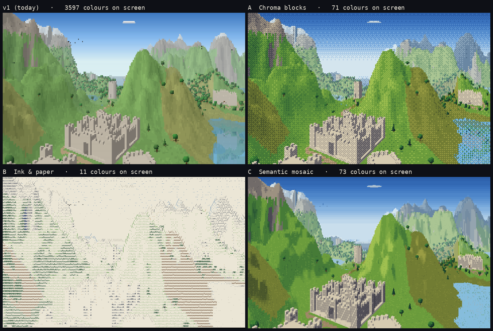

# Text Voxel v2

The renderer rebuild of [Text Voxel](https://github.com/OddSlice/text-voxel). The seeded voxel world stays: terrain, rivers, castles, roads, forests, merchants, lights, walking and trading. The way it is drawn changes, from v1's soft pixel mosaic to a deliberate, art-directed text-mode look that can stand next to the terminal RPG Swaggerfall.

v1 stays live as the baseline: https://oddslice.github.io/text-voxel/ (add `?seed=42`).

## Status: phase 0, choosing a direction

No engine code yet. This phase is research and mockups:

- **[docs/direction.md](docs/direction.md)**: the three candidates side by side, their grids, palettes, glyph sets and measured costs, the open numbers, and the recommendation (C, "Semantic mosaic").
- **[docs/research.md](docs/research.md)**: Swaggerfall, block and mosaic characters, shape-matched glyphs, dithering, ANSI and PETSCII discipline, palettes, with sources.
- **[docs/brief.md](docs/brief.md)**: the brief for this attempt.



## How the mockups are made

All mockups are rendered from real frames of the v1 world (seed 42, fixed cameras in `tools/scenes.json`), not painted. You need Node 18+ and Playwright's Chromium (`npm i -g playwright && npx playwright install chromium`); the sheets also need Pillow.

```sh
node tools/capture-v1.mjs        # v1 baseline frames + v1 timings              -> mockups/<scene>/v1.png
node tools/build-gbuffer.mjs     # instrument a copy of v1 to record what every pixel hit
node tools/capture-gbuffer.mjs   # dump one frame of world data per camera      -> tools/frames/<scene>/
node tools/render-mockups.mjs    # render candidates A, B, C from the dumps     -> mockups/<scene>/{a,b,c}.png
node tools/time-raymarch.mjs     # v1's raymarch at each candidate's ray density
node tools/bench.mjs             # cell-stage and compose timings
python3 tools/sheets.py          # comparison and zoom sheets, colours on screen
```

- `reference/v1-index.html` is v1 pinned at commit `989360b`. The world simulation will be ported from it.
- `tools/mockup/` holds the candidate renderers. It composes through the same Canvas2D ImageData path the engine will use.
