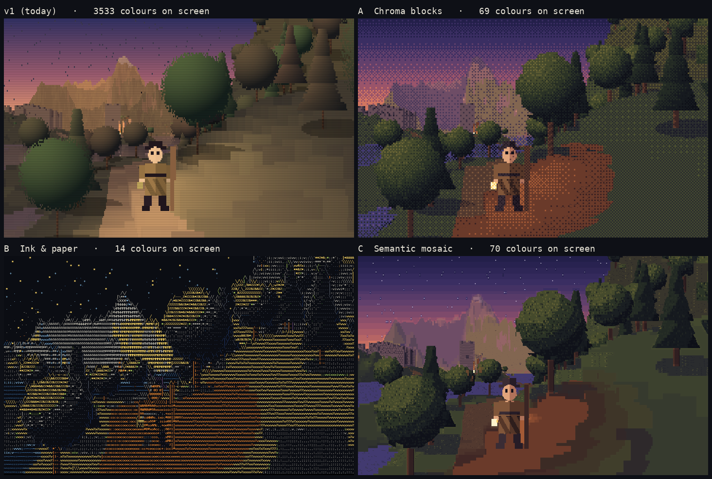
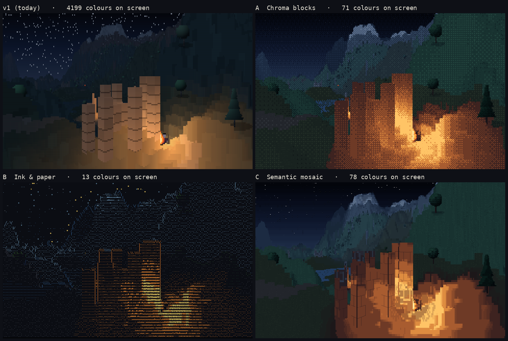

# Visual direction: pick one

**My recommendation: C, "Semantic mosaic."** Details below. Each candidate was rendered from the same world data: seed 42, the same three cameras, dumped from the running v1 engine. So you are comparing real scenes from our world under three techniques, not concept art. The findings behind all this are in [research.md](research.md).

## Why v1 reads as mush

Three things, all measured:

1. **About 3,500–4,200 colours on screen.** Continuous shading × 8 fog steps × a blended palette × per-point light leaves no palette identity.
2. **One colour per 4×7 px cell.** A glyph that small cannot carry a shape. The glyph "weave" is noise, and silhouettes come out as staircases.
3. **Soft presentation on a Retina screen.** The canvas is sized in CSS pixels, so a 2× screen upscales it with smoothing and every cell edge gets a blended seam ([crop](../mockups/compare/v1-retina-softening.png)). This one is a one-line fix whichever direction you pick.

## The three candidates, same frames

| Scene | Contact sheet (v1, A, B, C) | Same crop at 2× |
|---|---|---|
| Castle in the valley, 09:30 | [compare](../mockups/vista/compare.png) | [zoom](../mockups/vista/zoom.png) |
| Merchant on the lake road, 18:00 | [compare](../mockups/road/compare.png) | [zoom](../mockups/road/zoom.png) |
| Campfire at the stone circle, 22:30 | [compare](../mockups/fire/compare.png) | [zoom](../mockups/fire/zoom.png) |

The full-size 1440×900 frames are `mockups/<scene>/{v1,a,b,c}.png`. View them at 100%: the glyphs are the point, and a scaled-down view hides them.

### A — Chroma blocks (the safe one)

The Swaggerfall lineage, done carefully: a clean, dithered, palette-disciplined mosaic.

| | |
|---|---|
| Cell grid | 6×12 px, 240×75 = 18,000 cells (Swaggerfall's recommended 15–20k band) |
| Rays per cell | 1×2, one ray per half cell (240×150) |
| Colours per cell | 2: fg for the top half, bg for the bottom |
| Palette | Three hand-built keyframe palettes (day, dusk, night) of about 93 colours in 23 hue-shifted ramps, shared with C. **69–71 colours on screen.** |
| Glyphs | `▀` plus 26 hand-drawn texture marks |
| How glyphs are picked | If the two halves differ, `▀` with the top and bottom colours. If they agree, sometimes a texture mark (tuft, wave, crag, flake, leaf) in the neighbouring ramp step, anchored to the world. Tones are ordered-dithered (Bayer 4×4) at half-cell pixel level. |
| Cost on your Mac | Raymarch 0.6–0.75× v1's (fewer rays), about 2.5–3 ms; cell stage about 2 ms; compose about 2.7 ms. **About 7–8 ms a frame in Chromium**, with room to spare. Firefox runs v1 about 1.75× slower than Chromium, and A should still hold 60 fps there in typical views. |
| Verdict | Crisp and cheap, but it reads as pixel art, not text. |

### B — Ink & paper (the purely textual one)

The picture is made of letters. By day it is typewriter art on paper: the darker a surface, the denser its letters, so the sky is open paper. At dusk and night the page turns dark and the letters glow.

| | |
|---|---|
| Cell grid | 8×16 px, 180×56 = 10,080 cells |
| Rays per cell | 2×4 (360×225) |
| Colours per cell | 1 ink colour on one page colour, the PETSCII rule. **11–14 colours on screen** from 16 fixed inks. |
| Glyphs | 36 hand-drawn 8×16 letters and strokes, with a density ladder per material: grass `, ; i v x & @`, water `- ~ =`, rock `: ^ / % #`, leaves `' ; * % &`, stone `: = + # M` |
| How glyphs are picked | Brightness, auto-exposed per frame, picks the density, and a per-cell hash picks among the letters at that density. At silhouettes (an object against the sky, or against something 35% farther) the cell becomes a stroke `| - _ / \` following the 2×4 split (Acerola's idea, driven by object ids and depth instead of image gradients). |
| Cost on your Mac | Raymarch 0.9–1.2× v1's; cell stage 7–10 ms as mocked, about 2–3 ms once ported to lookup tables; compose about 2.7 ms. **About 8–11 ms a frame in Chromium** once ported. |
| Verdict | The most "ASCII", and the night frames are striking. But objects (the merchant, the castle) are the hardest to read, letter fields shimmer as the camera moves, and daylight on paper is an acquired taste. |

### C — Semantic mosaic (the ambitious one) — recommended

Every cell is two palette colours and one glyph, chosen two ways:

- **Edge cells** (where two objects meet, or one object at two depths such as a ridgeline): a table built once picks, from about 300 hand-built shapes, the one that best fits how the cell's rays split. Silhouettes are traced by the glyph's shape instead of smeared by averaging. The shapes are half and eighth blocks, quadrants, sextants, octants and smooth-mosaic wedges.
- **Interior cells**: the material speaks its own vocabulary. That means grass tufts, water strokes that carry the far shore's reflection, crags, snowflakes, leaf clubs, needles, bark, and mortar joints generated from the wall's own voxel courses.

| | |
|---|---|
| Cell grid | 6×12 px, 240×75 = 18,000 cells |
| Rays per cell | 2×4 (480×300). 2×6 was tested and shows no visible gain ([castle](../mockups/compare/c-rays-2x6-vs-2x4-castle.png), [tree](../mockups/compare/c-rays-2x6-vs-2x4-tree.png)). |
| Colours per cell | 2 (fg, bg), always from the keyframe palette. **70–78 colours on screen.** |
| Palette | The same three hand-built keyframe palettes as A. Each material also gets a "far" ramp, pulled halfway to the haze, for aerial perspective. There is a warm ramp for firelight. The sky is 6 bands. |
| Glyphs | 288 shape masks: solid, 16 horizontal and vertical partial blocks, 5 quadrants, 28 sextants, 118 octants and 120 wedges, counted up to fg/bg inversion. Plus 26 hand-drawn marks with about 20 placements each, so they never line up into rows, ░▒▓ drawn by hand, and mortar lines. |
| How glyphs are picked | **Edge cell:** split the 8 rays into two groups by object id and depth, index a 256-entry shape table (25–50 ms to build at startup), and give fg and bg the two groups' palette colours. **Interior cell:** place a material mark by world-anchored hash, with density falling off with distance. Where the cell sits on a seam between two tones, two fog layers, or lit and unlit ground, use a ░▒▓ transition. Around flames the air gets a warm ░▒ glow and rising sparks. |
| Cost on your Mac | Raymarch 1.5–1.9× v1's, about 6–7.5 ms in typical views and up to 13–17 ms in v1's heaviest view (a large castle at night, 7–9 ms today). Cell stage 4–6.5 ms as mocked, about 2–3 ms once ported to lookup tables. Compose about 3 ms (Canvas2D, as v1). **About 11–13 ms a frame typical: 60 fps in Chromium, with no headroom in the heaviest views, and not yet in Firefox.** |
| Verdict | Crisp silhouettes, a palette someone clearly chose, calm deliberate fog, and firelit nights. On your 2× screen each glyph is drawn at 12×24 device pixels, so the vocabulary is plainly legible. |

**What C needs to hold 60 fps everywhere.** These are phase-1 work, not guesses about the look:

1. March distant terrain (past about 150 cells, where fog has flattened it into haze layers) at one ray per cell.
2. Evaluate sprites once per cell for cells wholly inside them. Only edge cells need their rays to differ.
3. Turn the colour decisions into lookup tables, as v1's `matLUT` does.
4. If Firefox still misses, compose through WebGL2: a glyph atlas plus a per-cell fg/bg/glyph texture, about 0.3 ms.

The fallback is 7×14 cells (205×64 = 13k cells, 410×256 rays, about 1.1–1.3× v1's raymarch). The glyphs get bigger and the detail coarser.

## Recommendation

**C.** It is the only candidate that meets every point of the brief at once:

- It reads as text, where A reads as pixels.
- Silhouettes stay legible at a glance, which B cannot manage.
- The palette is chosen: about 70 colours on screen from designed ramps, against v1's 4,000.
- Skies and fog are drawn as bands and layers, not gradients.
- Firelight is a warm ramp with a glowing halo and sparks.

It is also the one Swaggerfall can't easily copy, because it leans on something a terminal renderer of arbitrary models doesn't have: per-ray object ids and depths from our own raymarch.

A's dithered palette discipline is folded into C (same palettes, same fog layers). B's letters are an option for later: an "ASCII purist" toggle, as Swaggerfall has.

## Open numbers (my defaults in bold)

| Question | Options | Default |
|---|---|---|
| Cell size | **6×12 (18k cells)** · 7×14 (13k, bigger glyphs, cheaper) · 8×16 (10k) | 6×12 |
| Rays per cell (C) | **2×4** · 2×6 (no visible gain, 25–50% more raymarch) | 2×4 |
| Palette size | **About 93 designed colours per keyframe, about 70 on screen** · hard cap of 32 per keyframe (more PETSCII, less nuance) | uncapped ramps |
| Time-of-day transition | **Crossfade the keyframe ramps and rebuild the colour tables (as v1 does today)** · hard switch with a dithered wipe | crossfade |
| Mark density | **About 50% of near cells**, fading to 0 by about 150 cells | 50% |
| Compose | **Canvas2D ImageData (v1's proven path), `image-rendering: pixelated`** · WebGL2 atlas | Canvas2D, WebGL2 only if Firefox needs it |
| Near-ground facets | **Bilinear heights and normals within about 20 cells** (fixes the big flat blocks at your feet; applies to any direction) · leave as v1 | bilinear |

## How the mockups were made

- `tools/build-gbuffer.mjs` instruments a copy of v1 (`reference/v1-index.html`, pinned to v1 commit `989360b`). For every pixel it paints, it records what it hit (terrain, wall, roof, underside, canopy, conifer, bush, trunk, boulder, merchant part, cloud, flame, sky, sun, moon), plus material, lighting term, depth, world or sprite-local coordinates, point-light contribution and water-reflection source.
- The world simulation is untouched. The only renderer changes make three of v1's cell-sized details resolution-independent: the canopy's ragged edge, the conifer jag, and trunk width.
- `tools/capture-gbuffer.mjs` dumps one frame per camera at 1440×900, with time frozen so birds, clouds, flames and merchants hold still.
- `tools/mockup/` renders each candidate by reading the dump **exactly at that candidate's ray positions**, so each mockup sees what its engine would see. It composes through the same Canvas2D ImageData path an engine would use.
- `tools/time-raymarch.mjs` times v1's own raymarcher at each candidate's ray density, and `tools/bench.mjs` times the cell and compose stages. Everything was measured in headless Chromium in a cloud container that runs v1 at about half your Mac's speed (8.1 + 3.8 ms against your ~4 + 2 ms at the spawn), so the costs above are halved. The cell-stage numbers come from unoptimised mockup code.
- I could not look at Swaggerfall frames: this container's network policy blocks itch.io and YouTube. See research.md §0.

## After you choose

Phase 1 (build, then one confirmation from you):
- Port the world simulation wholesale into this repo's `index.html`, keeping controls, HUD, trade panel and `window.TV`.
- Write the chosen renderer.
- Present crisply.
- Re-run the scripted movement suites against the new file.
- Check 60 fps at 1440×900 in Chromium, Firefox and WebKit, with real screenshots of these three scenes plus a night castle gate.

v1 stays live at https://oddslice.github.io/text-voxel/ as the baseline for side-by-side comparison.
