# Phase 1: the build

`index.html` is Text Voxel v2: a seeded world with castles, roads, forests, merchants, walking and trading (carried over from v1), drawn by a new renderer in direction C ("Semantic mosaic") with 3D solids for the trees and the merchants. It is one self-contained file with no dependencies. Open it, or serve the folder, and play. `?seed=42` gives the world in these pictures.

| | |
|---|---|
| 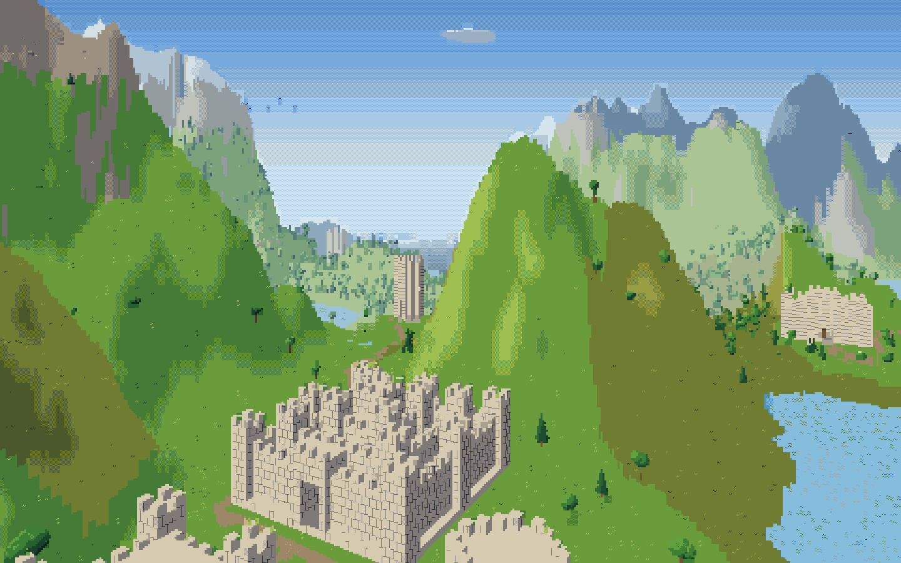 | 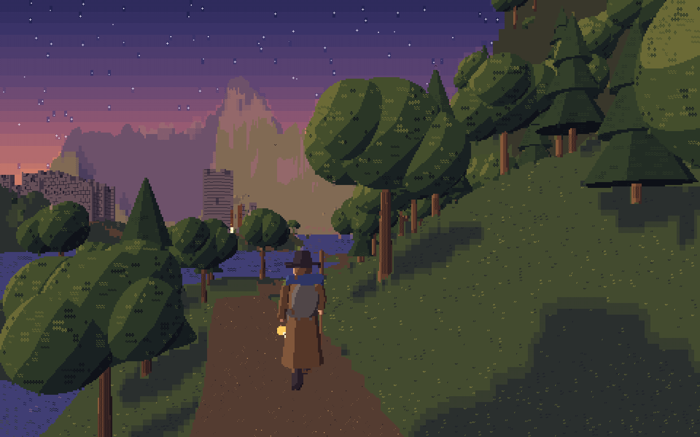 |
| 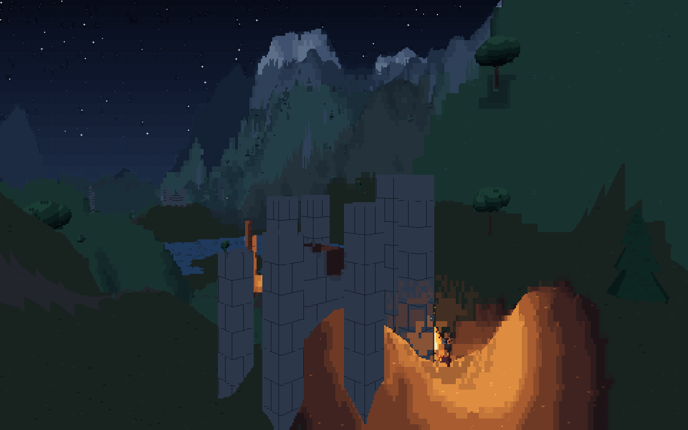 | 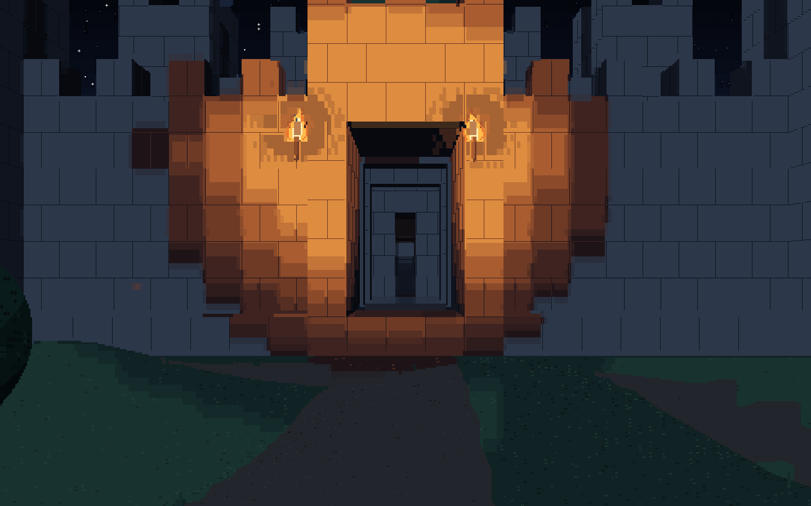 |
| 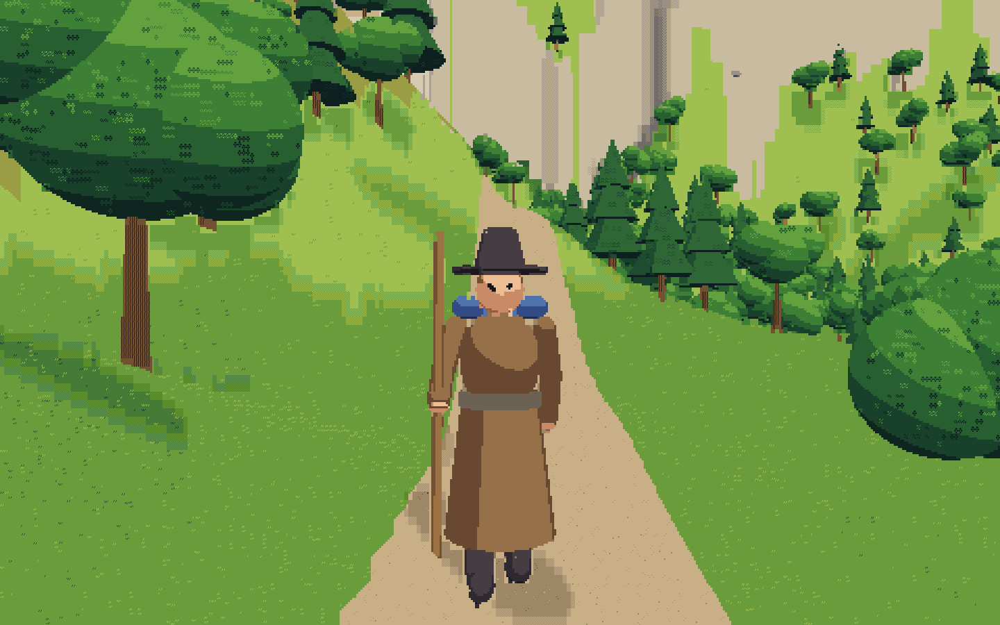 | 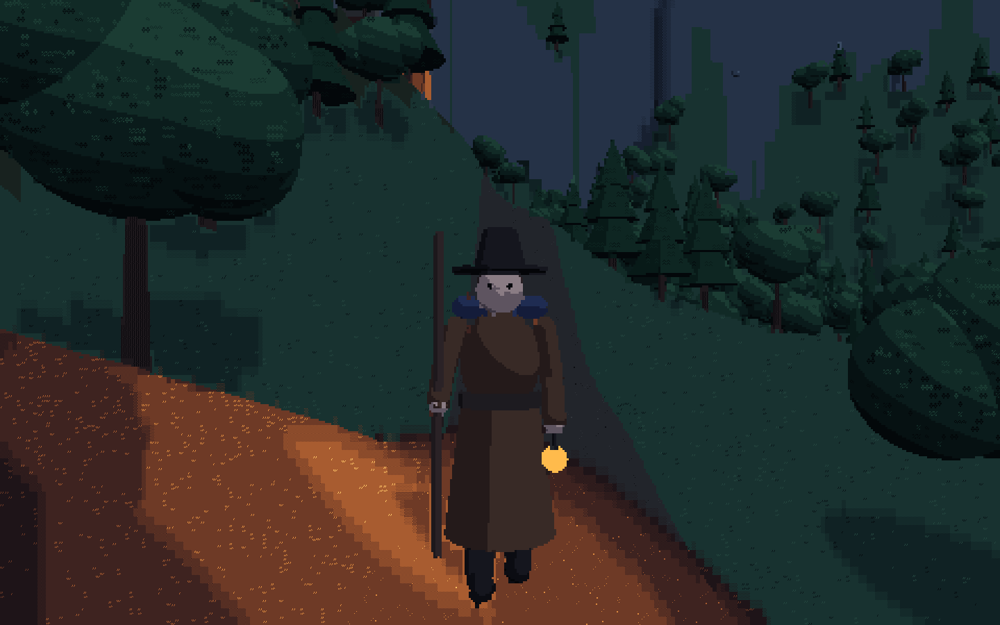 |
| 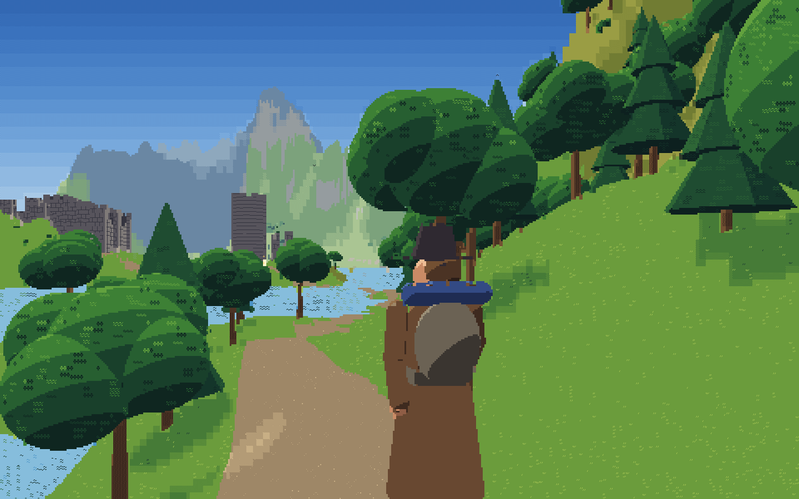 | 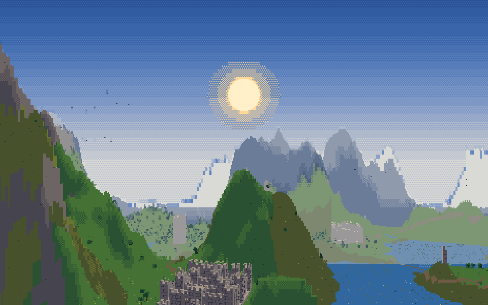 |

v1 and v2 from the same camera at the same hour (half size; open for 100%):

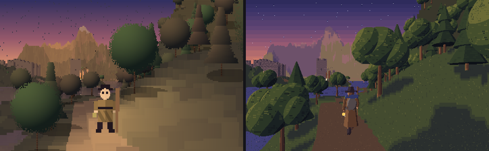
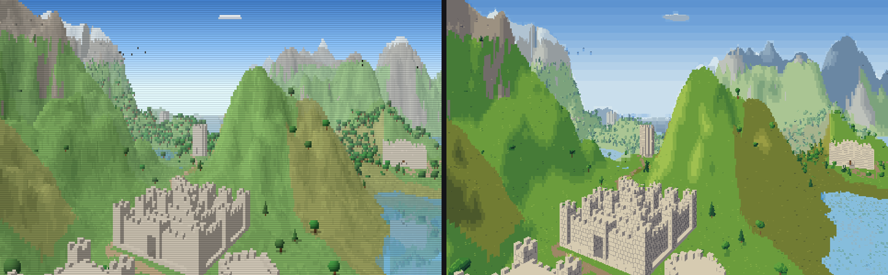
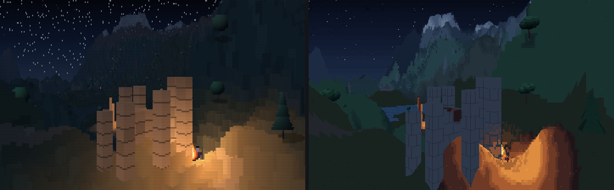

100% crops: [castle](../shots/zoom-vista.png), [merchant on the road](../shots/zoom-road.png), [campfire](../shots/zoom-fire.png).

## How a frame is drawn

The screen is a grid of text cells, 6×12 px by default (`−` / `+` step through 5×10, 6×12, 7×14 and 8×16). Every cell is exactly one glyph in two palette colours. Behind each cell, 2×4 rays are cast. A frame has three stages.

**1. Rays.** For each ray the renderer records what it hit: its kind, its segment, the colour ramp it is drawn from, where on that ramp its lighting puts it, its depth, and how much firelight reaches it. The segment is which object, and which face or part of it.

- **The march.** Terrain and structures are marched column by column, near to far, with v1's painted mask, so gaps under lintels stay open.
  - *Near ground* (inside 26 units): each ray finds its own point on the ground, with bilinear heights and lighting, so there are no flat blocks at your feet and road edges stay sharp.
  - *Far ground:* lighting is read from mip-mapped light maps (2×2, 4×4, 8×8 averages), so distant slopes don't stripe column by column.
  - *Skipping:* a 16×16 max-height grid lets the march skip whole blocks of ground that cannot rise above what is already painted.
  - *Walls:* each wall ray records its height up the wall, for mortar.
- **3D solids.** Every solid is built from spheres, ellipsoids, capsules, cylinders and cones, intersected exactly per ray (formulas after Inigo Quilez). Each is lit by its surface normal and depth-tested against the march, nearest first.
  - *Trees:* a canopy of one ellipsoid and four lumps, on a tapered trunk.
  - *Conifers:* three stacked cones.
  - *Bushes and boulders:* squashed ellipsoids.
  - *Clouds:* three soft lobes, lit from above.
  - *Campfires:* crossed logs.
  - Spheres and ellipsoids test only the rows each ray column can hit, from solving a quadratic per column. Vertical cones and cylinders have their own fast path.
- **Merchants.** Each is a rig of about 25 solids:
  - hat (brim and crown), hair, face with eyes and nose, beard on some;
  - neck, torso, robe skirt and belt;
  - sleeves in two segments, hands, legs and boots;
  - pack with a bedroll, staff, and a lantern after dark.
  - They walk with a stride cycle and face along their road. Within 9 units their head turns to look at you. The one you are talking to stops and turns to face you.
- **Flames** are light, not solids: a flickering teardrop on a camera-facing plane.
- **Ground marks.** Tufts, pebbles, flakes and ripples are points scattered in the world, denser near you, sized so each cell sees about the same number at any distance or height. Each is drawn in the cell it projects into, at the pixel it projects to, so marks flow with the ground as you walk instead of shimmering.
- **Shadows and reflections.** Trees and figures cast a soft disc on the ground away from the light. Water mirrors what stands on its far shore, as in v1.

**2. Cells.** Each cell turns its 8 rays into one glyph and two colours.

- **Edge cells.** Two things meet in the cell (another object, a ridge, a change of light on a solid). The rays split into two groups, and a 256-entry table built at startup picks the best-fitting shape for that split. The shapes are about 290 hand-built masks: half and eighth blocks, quadrants, sextants, octants and wedges.
- **Interior cells.** The material's own marks: tufts, pebbles, crags, flakes, leaf clusters, needles, bark, and mortar from the wall's own courses and running-bond joints.
- **Seams.** A second pass looks at each cell's neighbours. A narrow ░ or ▒ band appears only where the tone really changes: a step of light, a fog layer, the rim of firelight. Even ground stays one calm tone.
- **Colour.** Every colour comes from three hand-built keyframe palettes (day, dusk, night) crossfaded by the clock.
  - Ramps are hue-shifted. Each material has a "far" ramp pulled toward the haze, and fog falls in layers: near, far, haze, horizon.
  - Firelight has its own warm ramp, dim red at the edge of a pool to pale yellow at the flame.
  - A frame uses **34–73 colours**. v1 used 3,533–4,199 on the same cameras.
- **Overlays.** The sky gets stars (only once it is dark), a haloed sun, birds, firelight in the air and sparks. All are depth-tested, so a hidden flame lights nothing.

**3. Pixels.** Every glyph is a bitmask built in code, never a font glyph (so there are no WebKit baseline problems). The glyphs are composed into one ImageData.

- The canvas is set to `image-rendering: pixelated`, so on a 2× screen each glyph is drawn at 12×24 crisp device pixels instead of v1's smoothed ones ([2× sample](../shots/merchant.png)).
- No pixel is pure black: every background is a palette colour. Every colour channel is clamped.

**Workers.** All of the above lives in `renderCore()`.

- The page starts up to 6 Web Workers (one fewer than the machine's cores). Each gets a copy of `renderCore()`'s source and draws one vertical stripe of cells, then hands its pixels back by transfer.
- Each worker also computes one column of cells either side of its stripe, so seams are decided the same way on both sides of an edge. The picture is **pixel-identical** to the single-threaded one (checked).
- The world goes to the workers once per seed, the lighting whenever the sun moves, and the camera, clock and palette with every frame.
- Without workers, or with `?threads=0`, the same code runs on the main thread.

## The simulation

v2's world, rules, movement and trade came over from v1, and v2 owns them now. Two tests guard the port and flag any change to the simulation, so every change is a deliberate one, listed in `tools/lib/v2-fixes.mjs`.

- **Verbatim code.** `tools/check-verbatim.mjs` checks that 1,366 lines of v1's simulation, with v2's fixes applied, appear in `index.html` byte for byte: constants, terrain, rivers, structures, roads, trees, birds, lights, clouds, merchants, sky and lighting, input, movement, trade, HUD and lifecycle. The only change to v1's input code is the `− / +` key, which now steps through cell sizes.
- **Identical behaviour.** `tools/test-sim.mjs` drives v1 (with v2's fixes applied) and v2 side by side:
  - **Worlds.** Seeds 42, 7, 1234, 99991 and 31337 give identical checksums of every world array and object: heights, materials, normals, roads, trees, structures and their voxels, lights, clouds, birds, merchants. No v2 world has a NaN height.
  - **Play.** A 20.7 s scripted session (walk, sprint, jump, strafe, turn, fly, land) is **bit-identical** in both, every step, for the player, camera, merchants and clock.
  - **Walks.** Walking into every castle gate and every tower door of seed 42 takes the same path in both, and every walk ends inside.
- `window.TV` keeps v1's debug surface: `world, cam, clock, grid, stats, view, light, player, keys, ui, regenerate, setMode, update, updateMerchants, updateNearest, openPanel, closePanel, groundAt, setHour`. It adds `setCells(preset)`, `whenIdle()` (a promise for the frame in flight) and `renderer` (the main-thread renderer's buffers, live with `?threads=0`).

**Fixed in v2: a NaN height.**

- **Where.** v1's generator could give the lowest cell of a world a NaN height. On seed 42 that is cell (416, 390), with a conifer on it.
- **Cause.** The first step computes `Math.pow((H[i] - min) / range, 1.5)` on a Float32Array. When the minimum rounds down on storage, the base goes slightly negative and `pow` returns NaN. The sea flood then skips the cell, because `NaN < seaLevel` is false.
- **Effect in v1.** A player who waded onto that cell got a NaN foot height.
- **Fix.** v2 clamps the base at 0, so the cell joins the sea. The fix is listed in `tools/lib/v2-fixes.mjs`. The v1 comparison tests apply the same fixes to v1 before comparing, so they keep checking that nothing else changed. They also check that no v2 world has a NaN height.

## Speed

Measured in headless Chromium, 1440×900, in this cloud container, which runs v1 at about half the speed of your Mac. `tools/bench-v2.mjs` reports medians of five 60-frame windows. The frame time is wall time from starting a frame to its picture on the canvas.

| Scene | v2, 3 workers | v2, one thread |
|---|---|---|
| Castle in the valley | 10.1 ms, 57 fps | 17.9 ms |
| Merchant on the lake road | 10.6 ms, 58 fps | 19.8 ms |
| Campfire at night | 8.0 ms, 60 fps | 14.2 ms |
| Merchant close up, day | 10.2 ms, 60 fps | 22.2 ms |
| Merchant close up, lantern | 11.0 ms, 59 fps | 21.5 ms |
| Castle gate at night | 8.8 ms, 60 fps | 17.4 ms |

v1 costs about 12 ms a frame at the spawn in this container. With workers, v2 is slightly faster than v1 on four cores. On one thread it costs 1.5–1.8× v1. Your Mac should roughly halve these numbers and has more cores for workers.

Not measured here:

- **Firefox and WebKit.** This container has only Chromium installed, and the environment doesn't allow `playwright install`. Those two still need a run on a real machine: `node tools/bench-v2.mjs --browser firefox` and `--browser webkit`.
- **Pointer lock.** In headless Chromium, pointer lock alone drops v1 from 56 fps to 4 fps. That is an artefact of the headless environment, so play tests here use drag-to-look.

## Tools

```sh
node tools/test-sim.mjs          # the simulation still behaves as ported: worlds, a scripted session, gate and door walks
node tools/check-verbatim.mjs    # the ported simulation code, byte for byte (plus v2's listed fixes)
node tools/shoot.mjs             # screenshots of every scene in tools/scenes.json -> shots/
node tools/shoot.mjs --cam 300,70,250,-105,40 --hour 17 --out shots/x.png   # any camera
node tools/bench-v2.mjs          # frame timings (--threads 0 for the main thread, --browser firefox|webkit)
node tools/profile-v2.mjs road   # CPU profile of one scene
```

## What is still rough

- **Distant ridges.** Heights are sampled per ray without filtering, as in v1, so far silhouettes can still shimmer a little in motion. Lighting at distance is filtered; heights are not.
- **Tone changes on solids.** These are traced at ray resolution, so a canopy's light and shade can look faceted up close. The facets read as clumps of leaves, but a tuned canopy shader could do better.
- **Merchant faces.** They are simple: eyes, a nose, and a beard on two of the four. The rig could carry more character (pots on the pack, cloaks, different hats).
- **Clouds.** They are three lobes each, as in v1.
