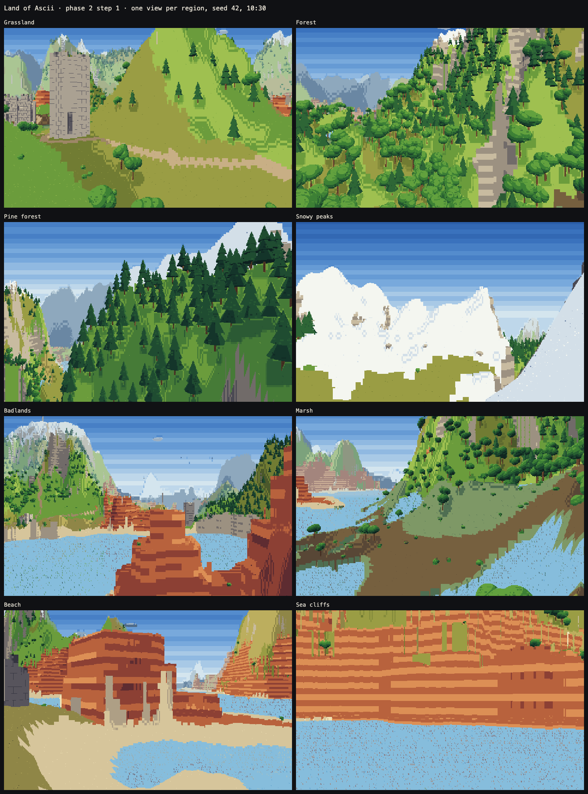
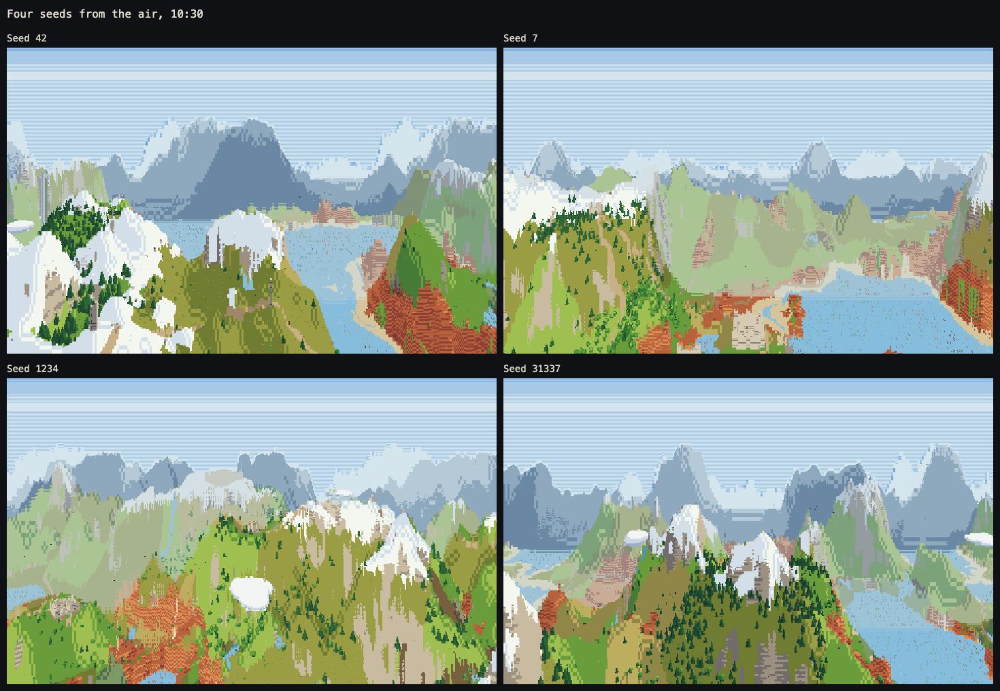
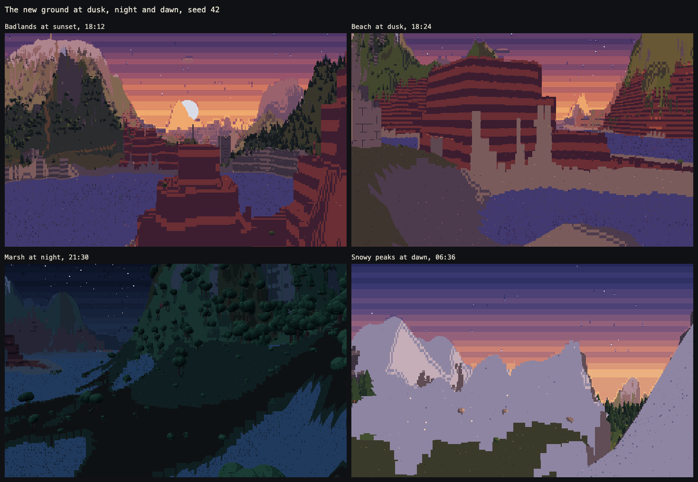

# Phase 2: a new world

The brief is [phase2-world.md](phase2-world.md). This file records how each step was built, with its pictures and numbers.

## Step 1: the design pass (regions and palette)

**Status:** built, shot and tested; waiting on Martin's confirmation of the regions and the palette before step 2 (land).

| | |
|---|---|
| [Region maps, four seeds](../shots/phase2/sheet-maps.png) | Regions on the left, the ground from above on the right, each region's share underneath |
| [From the air, four seeds](../shots/phase2/sheet-aerials.png) | 42, 7, 1234, 31337 |
| [One view per region](../shots/phase2/sheet-regions.png) | seed 42, 10:30 |
| [Dusk, night, dawn](../shots/phase2/sheet-light.png) | the new ground in the other two palettes |
| [The palette](../shots/phase2/palette.png) | the ground's ramps, day, dusk and night; the new ones marked |
| [Phase 1's scenes, re-aimed](../shots/phase2/sheet-classic.png) | the six scenes phase 1 was measured on, found again in the new world |

### The regions

Every cell of land belongs to one of eight regions: grassland, forest, pine forest, snowy peaks, badlands, marsh, beach and sea cliffs.

- **Climate.** Temperature and moisture are two broad noise fields (lattice 128 and 64 cells), bent by a slow warp (up to 24 cells) so borders meander.
  - Each field is turned into percentiles of the land, so every seed gets the same share of each climate.
  - Temperature falls with height before its percentiles are taken, so mountains are cold.
- **The chart.**
  - Cold land is pine forest.
  - Mild land is forest where it is damp and grassland where it is dry.
  - Hot land is badlands where it is dry and grassland where it is damp.
  - Badlands stay below 40 above the sea. Hot hills higher up are dry grassland, so no mesa climbs into the snow.
  - The wettest, lowest, flattest land (the top 12% on a score of all three) is marsh, except where it is cold.
  - The highest 7% of the land is snowy peaks. The line sits up to 8 lower where it is cold and up to 8 higher where it is hot.
- **The coast.** Shores of real bodies of water (2,000 cells or more) get a coast; ponds keep the region around them.
  - The shore is sandy beach where it is low and sea cliffs where it is rugged, with a noise mixing the two. By area, about half the coast is cliffs (a third to two thirds, by seed).
  - A marsh runs straight into the water.
- **Borders.** Every cell carries a weight for each region. Heights are shaped by the weights, so terrain blends smoothly.
  - Each cell's region is picked by a blotchy noise laid along its weights. Where two regions meet, they interleave in patches across a band about ten cells wide rather than along a line.

Share of the land on five seeds (from `tools/test-sim.mjs`):

| Region | 42 | 7 | 1234 | 99991 | 31337 |
|---|---|---|---|---|---|
| Grassland | 24.8% | 26.5% | 31.2% | 27.1% | 23.8% |
| Forest | 15.0% | 14.5% | 16.1% | 15.5% | 16.5% |
| Pine forest | 18.2% | 13.7% | 19.8% | 20.4% | 17.3% |
| Snowy peaks | 9.1% | 9.7% | 8.4% | 8.5% | 8.3% |
| Badlands | 13.0% | 14.4% | 11.6% | 13.5% | 14.4% |
| Marsh | 11.6% | 10.5% | 9.3% | 9.9% | 11.2% |
| Beach | 5.4% | 5.8% | 1.3% | 2.0% | 6.0% |
| Sea cliffs | 2.9% | 4.9% | 2.3% | 3.1% | 2.4% |

The sea stays about a quarter of the map. Regions come out roughly 100–250 cells across (see the maps), and the world is 512 wide (about 70 s to walk across).

### How each region shapes its ground

- **Grassland** is smoothed 45% of the way toward the lie of the land (a wide blur of the heights), into broad plains.
- **Badlands**:
  - the floor is flattened 75% of the way to the lie of the land;
  - mesas and buttes are raised on it in whole 7-unit steps (up to three), only well inside the region so none is cut off at a border;
  - everything is snapped to terraces, 86% flat tread and 14% steep face;
  - dry washes wind across the floor as shallow sandy channels.
- **Marsh** is pressed flat at the lie of the land (never below the sea), 0.7 to 2.3 above it, in hummocks and hollows.
  - Well inside a marsh, the hollows are pools, 0.55 above the lie of the land.
- **Beaches** slope gently from the water, 0.28 up per cell, over about 7 cells of sand.
- **Sea cliffs** rise sheer to 9–18 above the sea, ragged along their top, from a rocky foot one to three cells wide.
- **Snowy peaks, forest and pine forest** keep the base terrain.

Rivers are carved after all of this, so they cut gorges through cliffs and mesas on their way to the sea.

### Ground, colour and plants

- **Five new materials**, each a ramp in all three keyframe palettes, hue-shifted like the others (cool shadows, warm lights): sand, red rock, dry grass, mud and reeds.
  - Their marks are borrowed from the existing vocabulary for now. Sand ripples, cracks and reed stalks of their own come in step 2.
  - Where each goes:
    - **badlands:** red rock, dry-grass patches and sandy washes;
    - **marsh:** reeds (always next to water), mud and some rough grass;
    - **beaches:** sand;
    - **peaks:** snow wherever it can lie, bare rock on steep faces;
    - **sea cliffs:** rock from foot to edge, red rock where the climate is hot;
    - **grassland:** dry grass in its driest parts, and rougher grass where it is drier.
- **Rock strata** (a renderer change). Where a face of rock stands across several rows of a column, its rows fall into bands by world height (1.4 units each).
  - Each band is a step of tone from the next, with crisp edges between them. Red rock is banded strongly, grey rock gently.
  - Faces are lit from light averaged over 4×4 cells, so neighbouring columns agree.
  - Seams are skipped on faces, because the bands are already drawn as edges.
  - This is what makes the mesas read as mesas.
- **Plants by region**, with today's kinds only:
  - dense broadleaf forest and pine forest, their trees 1.3–1.35× taller;
  - groves and lone trees on the grassland;
  - sparse pines below the snow;
  - bushes standing in for the shrubs of the badlands and the marsh.
  - New plants (shrubs, dead trees, reeds, cacti, snow-line pines) come in step 2.
- **Castles stand in clearings** (16 cells beyond their walls, towers 6), so a castle's gate can be seen from the road and from the spawn point.

### The numbers

| | Proposed | Built |
|---|---|---|
| Region size | 120–200 cells across | roughly 100–250 cells across |
| Share of land | grassland 25, forest 20, pine forest 20, badlands 15, marsh 10, peaks 7 (%) | 24–31, 15–17, 14–20, 12–14, 9–12, 8–10 (%) |
| Coast | beaches 6–8 cells deep, cliffs 10–18 high, about half each | beaches 7 cells, cliffs 9–18, about half each by area (a third to two thirds by seed) |
| Border blend | about 10 cells | about 10 cells |
| Mesas | 3–5 terraces, 7 high, sheer | up to 3 raised levels on a stepped floor, 7 high, sheer |
| Marsh | within 2 of water level, pools about a quarter | 0.7–2.3 above its local level, pools about a quarter |
| Snow line | lower where cold | lower where cold; the peaks region snowy wherever snow can lie |

Forest came out a little under the proposal, and grassland a little over. Hot, damp land is grassland in this chart.

### Tests

- **`tools/check-verbatim.mjs`**: the comparison is retired for:
  - the materials (v1 118–119);
  - the world state and `generateWorld` (v1 261–360);
  - tree placement (v1 911–958).

  The 11 sections still unchanged pass: constants, helpers, noise, rivers, structures, roads, birds, lights, clouds, merchants, lighting, input, movement, trade and lifecycle.
- **`tools/test-sim.mjs`**:
  - **Worlds**, seeds 42, 7, 1234, 99991 and 31337:
    - generating twice gives the same checksum of all 24 parts;
    - the checksums match those recorded in `tools/world-hashes.json`, recorded in Chromium (re-record with `--record` after a deliberate change);
    - no height is NaN, none is out of reach, no land lies below the sea;
    - every region is present.
  - **Movement.** v1's page is loaded with v2's world. The 20.7 s scripted session is bit-identical in both, every step. The player never goes below the ground and never gets stuck.
  - **Walks.** Every castle gate and tower door of seed 42 walks in, on the same path in both.
- **Workers.** The default six workers and `?threads=0` give byte-identical screenshots.

### Speed

Before and after, on Martin's Mac (M1 Max, six render workers, 1440×900, `tools/bench-v2.mjs`). Phase 1 was measured on its six scenes; step 1 on all 22 scenes, which include the six re-aimed.

| | Phase 1 | Step 1 |
|---|---|---|
| Chromium | 4.2–4.8 ms a frame, 60 fps | 3.0–6.6 ms, 60 fps |
| Firefox | 3.7–4.5 ms, 120 fps | 3.9–7.7 ms, at least 109 fps |
| WebKit | 5.4–6.1 ms, 60 fps | 5.3–7.1 ms, 60 fps |

- The heaviest scene is seed 42 from the air, with thousands of trees in view.
- A world now takes about 0.45 s to generate, up from 0.13 s: climate, percentiles, blurs and distance fields.

### Tools

- `tools/map.mjs`: region maps.
- `tools/find-views.mjs`: re-aims the scenes after world generation changes:
  - a view per region, chosen by what an eye there would actually see;
  - aerials;
  - `--classic` for phase 1's six.
- `tools/palette.mjs`: the palette sheet.
- `tools/sheet.mjs`: contact sheets.
- Scenes now carry their own seed and view distance, and `tools/shoot.mjs`, `bench-v2.mjs`, `probe.mjs` and `profile-v2.mjs` honour both.
- The harness finds the Playwright inside a global playwright-cli, and gives Firefox the profile fix macOS 27 needs.

### Rough edges and questions for the confirmation

- **The marsh reads the weakest.** Its reeds are a flat ground colour until step 2's reed marks and reed clumps.
- **Snowfields are flat white** in full sun, with rock only on the steep faces.
- **Sunlit grey rock is beige.** That is phase 1's rock ramp, now seen more often on the new cliffs and peaks. It could be pulled greyer.
- **Grey rock strata** are applied gently to all rock faces (red rock strongly). They could be kept to red rock only.
- **Castles in clearings** change the look around every castle. It is a small change to how trees are placed.

## After step 1: the painted look

Martin's review of step 1 (28 Sep):

- the textures glitch and flicker here and there;
- depth is hard to read;
- it lacks the painted look of the current trend;
- it lacks reflections;
- it could have more of a living world's soul, and more diversity.

His reference was **Glyphmoor**, a one-file, no-engine text world trending on TikTok ([the video](https://www.tiktok.com/@glyphmoor/video/7689321367455534367), 60 s).

### What Glyphmoor does

Studied frame by frame, at up to 4× zoom:

- **Every pixel is a letter.** The picture is a grid of small square cells, about 170 × 300 in a 720 × 1280 video. Each cell is one colour carrying one letter chosen by what it shows: `%` stone, `^` roof tiles, `@` and `&` leaves, `.` sand, `#` planks, `~` water, `"` grass. The letter is a shade off its cell's own colour. From a distance it reads as a painting, and up close as text.
- **Painted light:**
  - continuous shading, with no stepped tones;
  - hard cast shadows from palms and trees on the sand;
  - darkening in corners;
  - hazy, bluish distance.
- **Water:** it reflects sky, clouds, castles and the sun's glitter path.
- **Life and variety:**
  - villages with houses you walk into (beds, floors), chimney smoke;
  - castles with red roofs, flags and great halls lit by torches;
  - palms, birches, giant mushrooms, flower meadows;
  - fireflies, auroras, lit windows, rain and cloud decks;
  - five switchable looks (ASCII, Runic, Blocks, Amber terminal and one more).
- **From the comments:**
  - Its own interiors shimmer along walls, which a commenter traced to building structures unit by unit.
  - Its world takes about 7 s to generate for a 2 km map.
  - Another developer builds only what is near the player and streams the rest from the seed.

### Flicker, measured

`tools/flicker` (a scratch tool; the method is simple enough to re-create):

- Walk the camera forward in small steps, with time frozen so only the camera moves.
- Count the cells that **blink**: change and change back a frame later, by more than 24 in some colour channel or in their glyph.

| Scene | Mosaic look (cells) | Painted look (half-cells) |
|---|---|---|
| Grassland | 0.55% per frame | 0.18% |
| Badlands | 0.45% | 0.19% |
| Castle vista | 0.33% | 0.17% |
| Road at dusk | 6.1% | 0.08% |
| Walking through the spawn gate at night | 5.2% | 0.05% |

The mosaic look flickers by design. Its three sources:

- the scattered ground marks pop from cell to cell;
- the ░▒ seams between tone steps switch on and off;
- the edge glyphs, fitted to 8 rays, re-pick their shape as silhouettes slide.

The painted look has no marks, no steps and no fitted shapes. What remains is mostly hill crests and thin shapes: pine tips, trunks, tower corners.

### What changed

- **The painted look** (`paintCells`, `composePainted`; now the default; **L** switches looks, `?look=mosaic` starts in the mosaic):
  - Each cell is drawn as two square pixels, its top and bottom halves.
  - A pixel is the average of its 2×2 rays. Each ray's colour is continuous: its ramp blended between steps at its light, toward the firelight ramp by the fire on it, and toward the haze by its distance.
  - Every pixel carries one letter for what it shows, a shade lighter or darker than its colour, fading into the distance:
    - `"` grass, `'` rough grass, `,` dry grass;
    - `|` reeds and trunks, `_` mud, `.` sand, `~` water;
    - `%` rock, `=` red rock, `*` snow, `:` road;
    - `#` stone walls, `+` wood;
    - `@` leaves, `&` bushes, `^` pines.
  - Texture fixed to the world, fading with distance:
    - leaves in light and dark clumps;
    - castle walls in courses of blocks, each its own shade, with darker joints;
    - a gentle mottle on the ground.
  - Firelight glows in the air around flames, stars come out at night, and birds are `v`.
- **Water reflections** (painted look). Water is dark in itself and takes its colour from what it mirrors.
  - A thing at distance D, seen in water met at distance t, shows at slope q·(2t/D − 1): at the water's edge for a cliff standing in it, and mirrored about the horizon for distant land and sky.
  - Three rounds of looking up that row and taking its distance settle it.
  - The mirror is swayed by a slow wave, averaged over three columns, and strongest toward the horizon.
- **Shadows and hollows** (both looks):
  - Every cell's light is its ambient share, dimmed in hollows and under trees (`world.ao`), plus its direct share.
  - The direct share is dimmed where terrain, walls or trees stand between the cell and the sun or moon.
  - That comes from `world.occ`, the top of whatever stands on each cell, walked toward the light on a grid of 2×2 cells with soft edges.
  - It is recomputed only when the light moves, about 6 ms. The tree shadow discs are gone from the painted look.
- **Steadier ground** (both looks):
  - Every row of the ground finds where its own ray meets the ground between two march steps, taken as a sloped segment.
  - Light is blended between the steps, and taken from blended cells at middle distance, not the nearest.
  - Heights far off are filtered to the march's step (height mips).
  - In the painted look, the ground's colour is blended from the four cells around each point, narrowed so edges stay crisp.
- **Thin shapes** (pine tips, trunks) are never thinner than about a ray at their distance.

### Speed

M1 Max, six workers, 1440×900; ten scenes including the heaviest (seed 42 from the air).

| | Painted | Mosaic |
|---|---|---|
| Chromium | 5.4–7.4 ms | 4.3–6.7 ms |
| Firefox | 6.3–9.6 ms (120 Hz, at least 60 fps) | 4.5–8.4 ms |
| WebKit | 6.4–12.8 ms | 5.4–7.3 ms |

Every scene holds 60 fps in all three browsers. Workers and the main thread give byte-identical frames in both looks.

### Tests

- All pass: the worlds are unchanged and as recorded.
- The lighting update (v1 1100–1126) is retired from the verbatim check, since it now carries shadows and hollows.
- The help line naming the L key is a listed fix.

### Next, and open

- **Still flickering a little:** hill crests and thin shapes, and tower corners, where x and z faces alternate. The tower corners are the commenter's "shimmer along the wall". Possible next steps are smooth shading for round towers and a light temporal filter.
- **Living world, into the phase 2 steps:**
  - flowers in the meadows;
  - castle roofs and flags;
  - chimney smoke, lit windows, fireflies, auroras;
  - weather (step 2), villages you can enter (step 3), people and animals (step 4).
- **A much larger world** would need generation streamed around the player, per the comment thread. That is a phase of its own.
